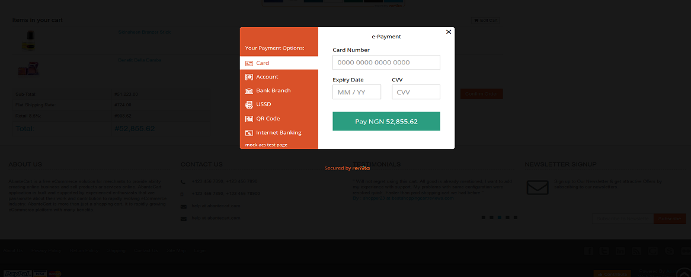
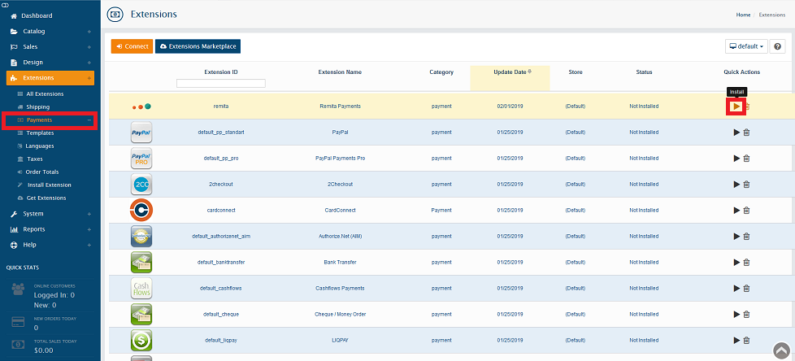
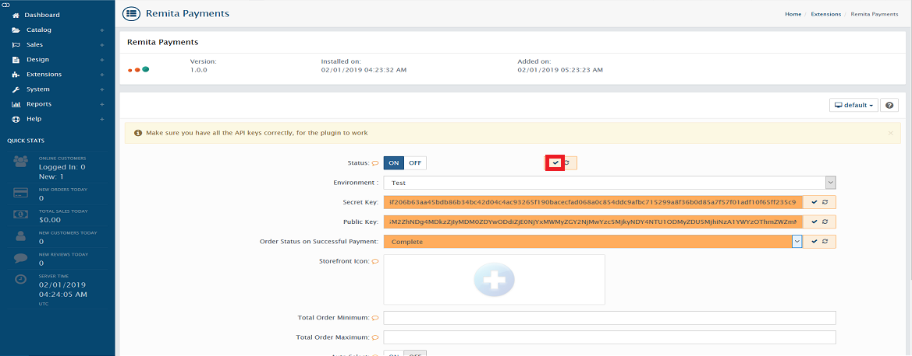
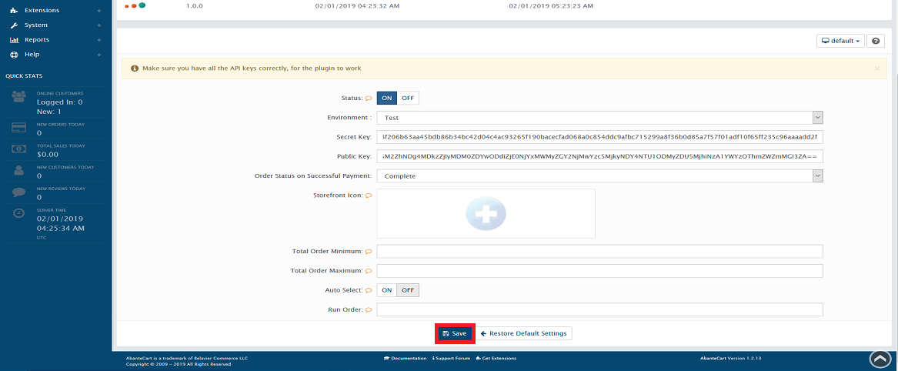

# Remita AbanteCart Payment Gateway

---
- [Overview](#Overview)
- [Installation](#Installation)
- [Usage](#Usage)
- [Features](Features)
- [Contributing](#Contributing)
- [License](License)

---
## Overview

With Remita AbanteCart Payment Plugin, the store admin can easily add all desired payment methods to the AbanteCart webshop. Please refer to https://www.remita.net for an overview of all features and services.

 

---

## Installation

1. Download the Remita plugin zip file.
2. Extract the downloaded file and Copy the extracted folder(remita folder) to *public_html* / *extensions* folder in your AbanteCart folder.
3. Login to your AbanteCart Admin. Click on "Extensions > Payments" from the left hand menu.
4. Scroll to "Remita" and click install.
 

---

## Usage

1. Log into the AbanteCart Admin.
2. Click on  *public_html* / *extensions* from the left hand menu.
3. Click on   *Edit* on Remita.
 

4. Set Status to 'On', Enter the public key and secrete key (these can be found in the Remita Gateway Admin Panel --> https://login.remita.net/remita/registration/signup.spa. Also, choose the Order Status on Successful Payment.
5. Click on each mark sign on each text field to save each inputed value.
 

6. Save the settings.

 

---

## Features

*   __Accept payment__ via Visa Cards, Mastercards, Verve Cards and eWallets.
* 	__Seamless integration__ into the AbanteCart checkout page.
* 	__Add Naira__ currency symbol.

### Useful links
Join our Slack Developer/Support channel on [slack.](http://bit.ly/RemitaDevSlack)
    
### Support
For all other support needs, support@remita.net

---

## Contributing
To contribute to this repo, follow these guidelines for creating issues, proposing new features, and submitting pull requests:

1. Fork the repository.
2. Create a new branch: `git checkout -b "feature-name"`
3. Make your changes and commit: `git commit -m "added some new features"`
4. Push your changes: `git push origin feature-name`
5. Submit a Pull Request (PR).

Thank you!

---

## License

This project is licensed under the MIT License - see the [LICENSE.md](LICENSE.md) file for details.
